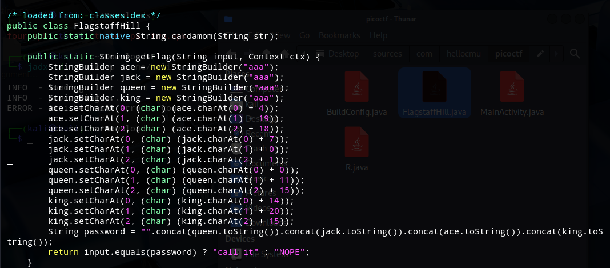

# Fifth Flag

Nothing new, jadx as always.

In the getFlag method, a password—alphabetsoup—is dynamically constructed by modifying characters in several StringBuilder objects (ace, jack, queen, king) using arithmetic operations, then concatenated in the order queen + jack + ace + king. If the user inputs this exact value, the method returns the message "call it", which hints at invoking a function. Since the only other function present in the activity is a native one from the JNI library, I decided to modify the APK to directly call that native method when the correct input is provided.



Again we modify the code using `apktool`

I then edited the file`four/smali/com/hellocmu/picoctf/FlagstaffHill.smali` specifically modifying it to replace the return message with a direct call to the native function using the correct input.


I rebuilt the application and signed it using the commands below—first to generate a keystore, then to sign the APK:
```
keytool -genkey -v -keystore my-release-key.jks -alias myalias -keyalg RSA -keysize 2048 -validity 10000
apksigner sign --ks my-release-key.jks --out signed_four2.apk four2.apk
```

Finally, by entering the string alphabetsoup, the application successfully returned the flag.


**picoCTF{not.particularly.silly}**
