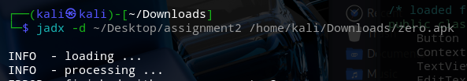
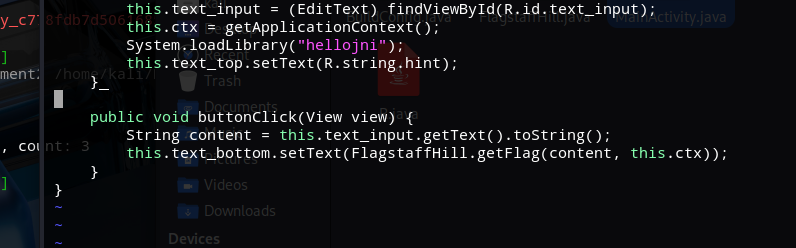
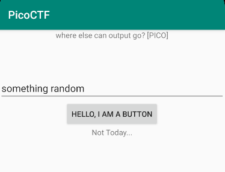
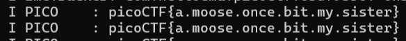

 # First flag

I've used jadx to decompile the `zero.apk` file to review the source code:

Going trough the files, we take a look at MainActivity and we find _buttonClick_ calling _getFlag_ method from FlagstaffHill class:

The _getFlag_ function captures and logs the result of invoking a native method from the JNI library, using the given input as its argument.

I've used an android emulator in order to run the app

After that I've looked into the logs searching for **pico**, reavealing the flag.

**picoCTF{a.moose.once.bit.my.sister}**

