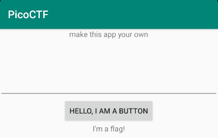
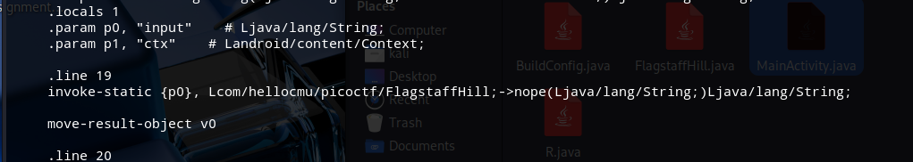

# Forth Flag

We already know the drill, `jadx` is our guy
Looking again into the files the we we trough the other 3 challenges, I looked directly in the app hoping to find a hind and I did.


Because of the message "make this app your own" it implies that I'll need to dearchivate the apk.

In order to get the flag we have to modify the file in wich function is called for the input. That file is named `FlagstaffHill.smali` and is found in the `three/smali/com/hellocmu/picoctf/` directory.
We change from "nope" to "yep".


I rebuild the app and sign it using the following commands
```
keytool -genkey -v -keystore my-release-key.jks -alias myalias -keyalg RSA -keysize 2048 -validity 10000
apksigner sign --ks my-release-key.jks --out three2-signed.apk three2.apk
```

reinstall teh emulator
```
adb install three2-signed.apk
```
Finally, it doesn't matter what I introduce because the flag is going to pop up either way.


**picoCTF{tis.but.a.scratch}**
