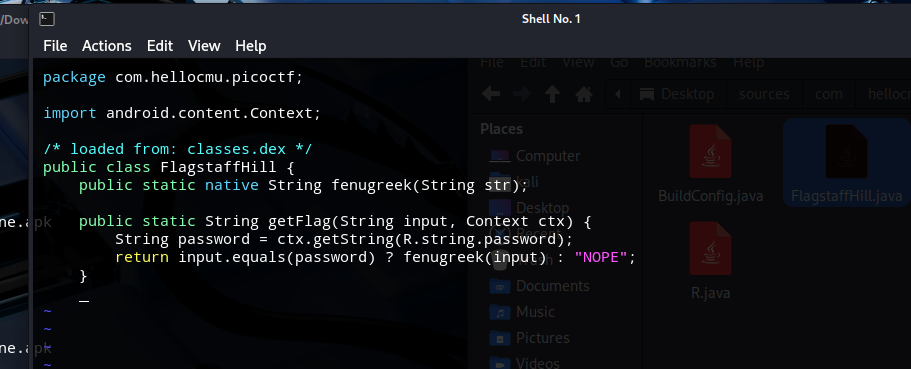
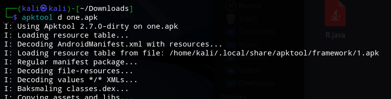
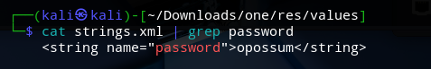

# Second Flag

Just like in the case of the `zero.apk` file, we use jadx to decompile te app.

It starts by calling a method _getFlag_ from FlagstaffHill class. 

The getFlag function checks if the input matches the app's internal password, and if so, it calls a native function to return the flag; otherwise, it returns "NOPE".

We start looking for the password by dearchivating the apk file and we do that by using `apktool`.

I've searched for the password in the `strings.xml` file, in the `/res/values` directory. 

We can clearly see that the password is `opossum`, and by introducing it into the the input app's box, the second flag is displayed.

**picoCTF{pining.for.the.fjords}**

