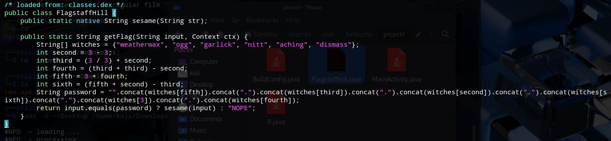

# Third Flag

Again, just like the other two challenges before, we use jadx and we look into the `flagstaffHill.java`.

The getFlag function internally generates the password "dismiss.ogg.weatherwax.aching.nitt.garlick" and, if the user enters it correctly, calls the native sesame() function to return the flag; otherwise, it returns "NOPE".

After that I ran the app in order to get the flag with the concatenated strings.

**picoCTF{what.is.your.favourite.colour}**

